# FaiconLingo Technical Architecture Overview

## 1. Executive Summary

FaiconLingo employs a **Robust Hybrid Architecture** designed to balance high-performance modern mobile user experiences with reliable, enterprise-grade content management. The core tenet of the architecture is an **Offline-First** capability, ensuring equitable access to language learning resources across Zambia, including rural areas with intermittent internet connectivity.

To achieve this, the system is decoupled into three primary tiers:
1.  **Client Application (Mobile & PWA):** Built with Flutter for a unified iOS/Android codebase, emphasizing smooth 60fps animations, intuitive UI/UX, and robust local storage.
2.  **Real-Time Data Layer:** Powered by Firebase, serving as the immediate syncing engine for user progress, authentication, and offline capability buffering.
3.  **Enterprise Backend (Admin & Analytics):** Driven by a PHP/Laravel API and MySQL database, giving content creators, the Ministry of Education, and other stakeholders a powerful platform to manage curriculum, track institutional analytics (FaiconLingo Academies), and securely manage data.

This staggered approach avoids relying solely on expensive real-time API calls for every action, minimizing data usage for the learner and reducing server costs.

---

## 2. High-Level System Architecture Diagram

```mermaid
graph TD
    subgraph Client ["Client Side (Mobile App & PWA)"]
        FlutterApp[("📱 Flutter App\n(iOS, Android, Web)")]
        LocalDB[("💾 Local Storage\n(Hive/SQLite)")]
        OfflineSyncEngine["Offline Sync Engine"]
    end

    subgraph Firebase_RealTime ["Real-Time Cloud Services"]
        FirebaseAuth["🔐 Firebase Auth"]
        Firestore["🔥 Firestore\n(User State & Streaks)"]
        FirebaseStorage["📁 Firebase Storage\n(Audio/Images)"]
    end

    subgraph Enterprise_Backend ["Management & B2B Backend"]
        LaravelAPI["🐘 PHP Laravel API"]
        MySQL[("🗄️ MySQL Database\n(Curriculum & Reports)")]
        AdminPortal["🖥️ Web Admin Panel"]
        AcademyPortal["🏫 Academy Educator Portal"]
    end
    
    subgraph Future_AI_Layer ["Phase 2: AI Integrations"]
        OpenAI_Whisper["🎙️ Speech-to-Text (Whisper)"]
        AI_Chatbots["🤖 Conversational AI"]
    end

    %% Client Interactions
    FlutterApp -- "Reads/Writes (Fast)" --> LocalDB
    FlutterApp -- "Syncs State (When Online)" --> Firestore
    FlutterApp -- "Authenticates" --> FirebaseAuth
    FlutterApp -- "Downloads Media" --> FirebaseStorage
    
    %% Internal Syncing
    Client -- "Managed Sync" --> OfflineSyncEngine
    OfflineSyncEngine -. "Background Sync" .-> Firebase_RealTime

    %% Enterprise Backend Connections
    Firestore -- "Event Webhooks/Sync" --> LaravelAPI
    LaravelAPI -- "Manages Curriculum" --> Firestore
    LaravelAPI -- "Reads/Writes" --> MySQL
    AdminPortal -- "REST" --> LaravelAPI
    AcademyPortal -- "REST" --> LaravelAPI
    
    %% AI Connections (Dotted for Future)
    FlutterApp -. "Phase 2 Voice Rec" .-> Future_AI_Layer
```

---

## 3. Core Architectural Layers

### 3.1 Client Tier: Flutter Mobile Ecosystem
**Role:** Deliver the interactive gamified learning experience to the end-user.
**Technologies:**
*   **Framework:** Flutter (Dart) for cross-platform (iOS, Android, PWA via Web).
*   **State Management:** BLoC (Business Logic Component) or Riverpod, providing predictable state transitions suitable for complex lesson flows.
*   **Local Storage:** Hive (NoSQL, fast lightweight key-value store for preferences and cached lesson data) or SQLite (sqflite for relational offline queries).
*   **Offline Strategy:** The app downloads compressed lesson bundles (JSON structures + light audio/images) on Wi-Fi/strong cellular. Lesson interactions (passing quizzes) are written to local storage and then queued for upload when connectivity is restored.

### 3.2 Real-Time Cloud Tier: Firebase
**Role:** Handle immediate client requests, authentication, and seamless device-to-cloud synchronization.
**Technologies:**
*   **Authentication:** Firebase Auth (Email, Google, Apple ID) ensuring secure, out-of-the-box identity management.
*   **Database:** Cloud Firestore. Used for hot data: current streak counts, recent XP, live leaderboard status, and active user profile states.
*   **File Storage:** Firebase Storage acts as a CDN for delivering audio pronunciations, mascot animations, and cultural artwork efficiently.
*   **Messaging:** Firebase Cloud Messaging (FCM) for push notifications (e.g., "Keep your Flame Streak alive!").

### 3.3 Enterprise Backend Tier: PHP / Laravel
**Role:** Act as the system of record, administrative control center, and business logic driver for B2B features.
**Technologies:**
*   **Framework:** Laravel (PHP 8.x). Chosen for its maturity, ecosystem, and ease of creating complex B2B dashboards.
*   **Database:** MySQL. Used for structured, relational "cold" data: the master curriculum of all 73 languages, historical analytics over time, school/cohort mappings for FaiconLingo Academies.
*   **Interoperability:** The Laravel instance maintains a sync with Firebase via Admin SDKs. When an administrator adds a new Nyanja proverb in the Laravel Panel, Laravel pushes that document update into Firestore, which seamlessly syncs down to the mobile devices.

---

## 4. Architectural Design Principles

### Principle 1: Deterministic Learning Mechanics (Phase 1)
To ensure cost predictiveness and complete offline reliability, Phase 1 relies strictly on standard software logic rather than third-party AI APIs. Progression, spaced repetition, and grading are handled mathematically via local databases rather than relying on external large language models (LLMs). 

### Principle 2: "Tourists vs. Locals" Customization
The architecture supports heavy segmentation. The backend structure of curriculum is tagged meticulously so the Flutter app can instantly pull down different lesson trees depending on the user's initial onboarding profile (e.g., Tourist survival tree vs. Diaspora deep-culture tree).

### Principle 3: Built for Scale
By utilizing Firebase for edge-node real-time syncing and Laravel for robust relational management, the app can smoothly scale from the initial 7 target languages (Bemba, Nyanja, Tonga, etc.) up to all 73 local languages without needing a fundamental rewrite of the data schemas. 

### Principle 4: Graceful Degradation
If Firebase services are unreachable due to a network outage in a rural Zambian province, the application must not crash or prevent learning. The LocalDB serves as the primary source of truth for the session, failing gracefully and reconciling data upon the next successful network ping.
