# FaiconLingo: Presentation Strategy & Content

**Time Limit:** 10 Minutes
**Audience:** Business Stakeholders & Technical Advisors
**Goal:** Demonstrate unique value proposition, technical competence, and a "premium" vision.

---

## 1. Opening: The Vision (1 Minute)

**Slide Visual:** High-Impact Title Slide with Zambian Map overlay, diverse faces (youth/elders).
**Title:** FaiconLingo: Preserving Heritage, Empowering Future.

**Speaker Notes:**
-   "Good morning. We are here not just to build an app, but to build a digital bridge between generations."
-   "We understand FaiconLingo is not just a translation tool; it is a **Cultural Preservation Engine**."
-   "Our vision is to make learning Bemba, Nyanja, or Lozi as addictive and high-quality as Duolingo, but deeply rooted in our Zambian context."

---

## 2. The Problem & Our Unique Insight (1 Minute)

**Slide Visual:** Split screen. Left: "Fragmented Resources" (Old books, bad audio). Right: "Disconnected Youth" (Gen Z on phones).

**Key Talking Points:**
-   **The Gap:** Current solutions are "dry" and "academic". Youth engage with *experiences*, not just textbooks.
-   **Our Insight:** "Education First, Engagement Always." We don't just teach the language; we gamify the *culture*.
-   **The Risk:** Without a "premium" feel, users will download it once and delete it. We are building for **retention**.

---

## 3. The Solution: "High-Definition" Learning (3 Minutes)

**Strategy:** Show, Don't Tell. Walk them through the "Hero's Journey".

### Slide A: The "Village Path" (Gamification)
**Visual:** [Screenshot: **Home Dashboard**] (`mockups/home.html`)
**Talking Points:**
-   **Map-Based Progression:** Instead of a boring list of lessons, users travel a path—from the city (Lusaka) back to the village.
-   **Visual Progress:** The "Daily Flame" streak encourages habit formation (proven retention mechanic).
-   **Clan Verification:** (Unique Feature) We encourage social interaction. Users must "Verify" their skills with a real native speaker (Elder/Parent) to earn the "Clan Badge".

### Slide B: Immersive Lessons
**Visual:** [Screenshot: **Interactive Lesson**] (`mockups/lesson.html`)
**Talking Points:**
-   **Comic-Style Dialogue:** Context is key. We use visual storytelling, not just isolated words.
-   **AI Pronunciation:** Users speak, and our integration with **OpenAI Whisper** gives instant feedback.
-   **Offline First:** We know data is expensive. This lesson content is cached locally.

### Slide C: Assessment & Feedback
**Visual:** [Screenshot: **Gamified Quiz**] (`mockups/quiz.html`)
**Talking Points:**
-   **Scenario-Based Learning:** "How do you receive food from an elder?" (Culture, not just Grammar).
-   **Immediate Gratification:** Positive reinforcement loop (Sound, Animation, Haptic feedback).

### Slide D: The "Nsaka" (Cultural Preservation)
**Visual:** [Screenshot: **Cultural Stories**] (`mockups/culture.html`)
**Talking Points:**
-   **The Soul of the App:** This is what separates us from generic competitors.
-   **Digital Fireplace:** Stories, Proverbs, and Wisdom shared by real elders.
-   **Shareable Content:** "Wisdom of the Day" cards for social media virality.

---

## 4. Technical Architecture (2 Minutes)

**Slide Visual:** The "Robust Hybrid" Diagram (See below).

**Talking Points:**
-   **Hybrid Approach:** We combine the best of modern mobile tech with robust enterprise management.
-   **Mobile (Flutter):** One codebase for iOS and Android. High performance (60fps), beautiful animations.
-   **Real-Time & Offline (Firebase):** Syncs progress when online, works perfectly when offline.
-   **Admin & Reporting (PHP/Laravel):** A powerful backend for the Ministry/Stakeholders to view analytics, manage curriculum, and generate reports.
-   **AI Layer:** Python/Streamlit for verified content entry + OpenAI for voice processing.

### Architecture Diagram (Infographic)

```mermaid
graph TD
    subgraph Client ["Client Side (Mobile App)"]
        FlutterApp[("📱 Flutter App\n(iOS & Android)")]
        LocalDB[("💾 Local Storage\n(Hive/SQLite)")]
        OfflineLogic["Offline Logic Engine"]
    end

    subgraph Cloud ["Cloud Services (Real-Time)"]
        Firebase["🔥 Firebase"]
        Auth["Authentication"]
        Firestore["Real-time Datastore"]
        Storage["Media Storage (Audio)"]
    end

    subgraph Backend ["Enterprise Backend (Admin)"]
        Laravel["🐘 PHP (Laravel) API"]
        MySQL[("🗄️ MySQL Database\n(Structured Data)")]
        AdminPanel["🖥️ Admin Dashboard\n(Content & Reports)"]
    end

    subgraph AI_Services ["AI & Content Factory"]
        Whisper["🗣️ OpenAI Whisper\n(Voice Analysis)"]
        Streamlit["🛠️ Streamlit Tool\n(Content Entry)"]
    end

    %% Connections
    FlutterApp <-->|"Syncs Data"| Firebase
    FlutterApp <-->|"Reads Content"| LocalDB
    FlutterApp -->|"Sends Voice"| Whisper
    
    Firebase <-->|"Syncs User Stats"| Laravel
    Laravel <--> MySQL
    
    Streamlit -->|"Uploads Content"| Laravel
    Streamlit -->|"Uploads Media"| Storage
```

---

## 5. Our Unique Value Proposition (2 Minutes)

**Slide Visual:** 4 Pillars Icons.

1.  **Retention Design:** We used gamification strategies from our proven EdTech experience (EasySchool) to keep users coming back.
2.  **Cultural Depth:** It's not just language; it's manners, proverbs, and connection.
3.  **Technically Sound:** Offline-first architecture ensures accessibility for *all* Zambians to urban and rural.
4.  **Future-Proof:** Built on scalable tech (Flutter/Cloud) that can easily add new languages.

---

## 6. Closing (1 Minute)

**Slide Visual:** "Let's Build This Together."

**Speaker Notes:**
-   "FaiconLingo is the project Zambia has been waiting for."
-   "We have the technical roadmap, the design vision, and the passion to execute."
-   "Thank you. Open for questions."
