# FaiconLingo: Presentation Strategy & Content

**Time Limit:** 10 Minutes
**Audience:** Business Stakeholders & Technical Advisors
**Goal:** Demonstrate unique value proposition, technical competence, and a "premium" vision.

---

## 1. Opening: The Vision (1 Minute)

**Slide Visual:** High-Impact Title Slide with Zambian Map overlay, diverse faces (youth/elders).
**Title:** FaiconLingo: Preserving Heritage, Empowering Future.

**Speaker Notes:**
-   "Good morning. We are here not just to build an app, but to build a digital bridge between generations."
-   "We understand FaiconLingo is not just a translation tool; it is a **Cultural Preservation Engine**."
-   "Our vision is to make learning Bemba, Nyanja, or Lozi as addictive and high-quality as Duolingo, but deeply rooted in our Zambian context."

---

## 2. The Problem & Our Unique Insight (1 Minute)

**Slide Visual:** Split screen. Left: "Fragmented Resources" (Old books, bad audio). Right: "Disconnected Youth" (Gen Z on phones).

**Key Talking Points:**
-   **The Gap:** Current solutions are "dry" and "academic". Youth engage with *experiences*, not just textbooks.
-   **Our Insight:** "Education First, Engagement Always." We don't just teach the language; we gamify the *culture*.
-   **The Risk:** Without a "premium" feel, users will download it once and delete it. We are building for **retention**.

---

## 3. The Solution: Key Features (4 Minutes)

**Strategy:** Show, Don't Tell. Walk them through each dimension of the app using the visual mockups.

### Slide 3: Personalized Journeys
**Visual:** [Screenshot: **Onboarding**] (`mockups/onboarding.html`)
**Talking Points:**
-   **Segmentation:** We aren't building a one-size-fits-all tool. A tourist needs survival phrases; a local needs deep cultural fluency.
-   **Goal-Based Adaptation:** The user journey completely reconfigures based on their goals and performance.
-   **First Impression:** High-quality language selection screen sets a premium tone immediately.

### Slide 4: Beginner-Friendly Lessons
**Visual:** [Screenshot: **Alphabet**] (`mockups/alphabet.html`)
**Talking Points:**
-   **Step-by-step:** We don't overwhelm users. We start with the alphabet, basic greetings, and core phrases.
-   **Bite-sized:** Lessons are short engagements designed to be completed in 5 minutes.
-   **Visual & Interactive:** Tap-to-translate and visual aides make starting easy for anyone.

### Slide 5: Native Audio & AI Pronunciation
**Visual:** [Screenshot: **Interactive Lesson**] (`mockups/lesson.html`)
**Talking Points:**
-   **Authenticity:** Audio isn't robotic; we use high-quality recordings from real native speakers.
-   **AI Integration:** Users speak into the app, and our backend integration (like OpenAI Whisper) gives instant pronunciation feedback.
-   **Contextual:** Words aren't taught in isolation, but in real comic-style dialogues.

### Slide 6: Interactive Quizzes
**Visual:** [Screenshot: **Gamified Quiz**] (`mockups/quiz.html`)
**Talking Points:**
-   **Gamification:** This is how we ensure retention. Matching pairs, fill-in-the-blanks.
-   **Immediate Gratification:** Positive reinforcement loop (Sound, Animation, Haptic feedback) when you get it right.
-   **Cultural Scenarios:** "How do you receive food from an elder?" We quiz culture, not just grammar.

### Slide 7: The Nsaka (Cultural Heritage)
**Visual:** [Screenshot: **Cultural Stories**] (`mockups/culture.html`)
**Talking Points:**
-   **The Soul of the App:** This is our Unique Value Proposition that standard language apps don't have.
-   **Digital Fireplace:** Stories, Proverbs, and Wisdom shared by real elders.
-   **Viral Output:** Shareable "Wisdom of the Day" cards for Instagram/Facebook to organically market the app.

### Slide 8: Progress & Community
**Visual:** [Screenshot: **Leaderboard**] (`mockups/leaderboard.html`)
**Talking Points:**
-   **The Flame Streak:** The core mechanic for daily retention. If they break their streak, they lose their progress flame.
-   **Leaderboards:** Friendly competition among peers or academies.
-   **Clan Verification:** A user can only get a "Clan Badge" by speaking to a verified elder.

### Slide 9: Offline Access
**Visual:** [Screenshot: **Learning Path**] (`mockups/learning_path.html`)
**Talking Points:**
-   **Bridging the Divide:** We know data is expensive in Zambia.
-   **Local Caching:** Content caches when on WiFi so the app remains fully functional in low-connectivity settings.
-   **The Village Path:** The visual progression stays seamless whether online or offline.

### Slide 10: FaiconLingo for Academies
**Visual:** [Screenshot: **Academy Portal**] (`mockups/academy.html`)
**Talking Points:**
-   **B2B Potential:** FaiconLingo isn't just for individuals. It's an institutional tool.
-   **Educator Portal:** Teachers can assign lesson paths, monitor student comprehension, and run custom assessments.
-   **Riding the Wave:** We enable local language institutes to leverage our gamified platform for their own students.

### Slide 11: Reports & Dashboard Analytics
**Visual:** Two-column text layout with a large analytics icon block.
**Talking Points:**
-   **Data-Driven:** We don't just guess what works. The platform tracks user engagement and drop-off points to continuously improve lesson pacing.
-   **Stakeholder Reporting:** Easy-to-read, exportable ROI and performance dashboards for investors and management.
-   **Cohort Tracking:** Language institutes can see exactly how their specific students are progressing.

### Slide 12: Management Portal
**Visual:** Split layout highlighting Content, Users, and Push Notifications with a "Mission Control" graphic.
**Talking Points:**
-   **Mission Control:** An enterprise-grade CMS that allows full control without needing to release App Store updates.
-   **Agility:** You can inject new cultural proverbs, update audio files, or fix typos instantly from the web.
-   **Re-Engagement:** Built-in Push Notification center to bring back users who are breaking their learning streaks.

### Slide 13: PWA Web App
**Visual:** Blue gradient column outlining PWA benefits (Progressive, Responsive, Discoverable).
**Talking Points:**
-   **Frictionless Access:** Users can start a lesson instantly through a web link. No App Store download required just to try it.
-   **High Accessibility:** Works flawlessly on any mobile, tablet, or desktop browser.
-   **Bypassing Fees:** Direct web subscriptions allow us to bypass the 30% App Store "Apple Tax," increasing profitability.

---

## 4. Technical Architecture (2 Minutes)

**Slide Visual:** The "Robust Hybrid" Diagram (See below).

**Talking Points:**
-   **Hybrid Approach:** We combine the best of modern mobile tech with robust enterprise management.
-   **Mobile (Flutter):** One codebase for iOS and Android. High performance (60fps), beautiful animations.
-   **Real-Time & Offline (Firebase):** Syncs progress when online, works perfectly when offline.
-   **Admin & Reporting (PHP/Laravel):** A powerful backend for the Ministry/Stakeholders to view analytics, manage curriculum, and generate reports.
-   **AI Layer:** Python/Streamlit for verified content entry + OpenAI for voice processing.

### Architecture Diagram (Infographic)

```mermaid
graph TD
    subgraph Client ["Client Side (Mobile App)"]
        FlutterApp[("📱 Flutter App\n(iOS & Android)")]
        LocalDB[("💾 Local Storage\n(Hive/SQLite)")]
        OfflineLogic["Offline Logic Engine"]
    end

    subgraph Cloud ["Cloud Services (Real-Time)"]
        Firebase["🔥 Firebase"]
        Auth["Authentication"]
        Firestore["Real-time Datastore"]
        Storage["Media Storage (Audio)"]
    end

    subgraph Backend ["Enterprise Backend (Admin)"]
        Laravel["🐘 PHP (Laravel) API"]
        MySQL[("🗄️ MySQL Database\n(Structured Data)")]
        AdminPanel["🖥️ Admin Dashboard\n(Content & Reports)"]
    end

    subgraph AI_Services ["AI & Content Factory"]
        Whisper["🗣️ OpenAI Whisper\n(Voice Analysis)"]
        Streamlit["🛠️ Streamlit Tool\n(Content Entry)"]
    end

    %% Connections
    FlutterApp <-->|"Syncs Data"| Firebase
    FlutterApp <-->|"Reads Content"| LocalDB
    FlutterApp -->|"Sends Voice"| Whisper
    
    Firebase <-->|"Syncs User Stats"| Laravel
    Laravel <--> MySQL
    
    Streamlit -->|"Uploads Content"| Laravel
    Streamlit -->|"Uploads Media"| Storage
```

---

## 5. Our Unique Value Proposition (2 Minutes)

**Slide Visual:** 4 Pillars Icons.

1.  **Retention Design:** We used gamification strategies from our proven EdTech experience (EasySchool) to keep users coming back.
2.  **Cultural Depth:** It's not just language; it's manners, proverbs, and connection.
3.  **Technically Sound:** Offline-first architecture ensures accessibility for *all* Zambians to urban and rural.
4.  **Future-Proof:** Built on scalable tech (Flutter/Cloud) that can easily add new languages.

---

## 6. Closing (1 Minute)

**Slide Visual:** "Let's Build This Together."

**Speaker Notes:**
-   "FaiconLingo is the project Zambia has been waiting for."
-   "We have the technical roadmap, the design vision, and the passion to execute."
-   "Thank you. Open for questions."
